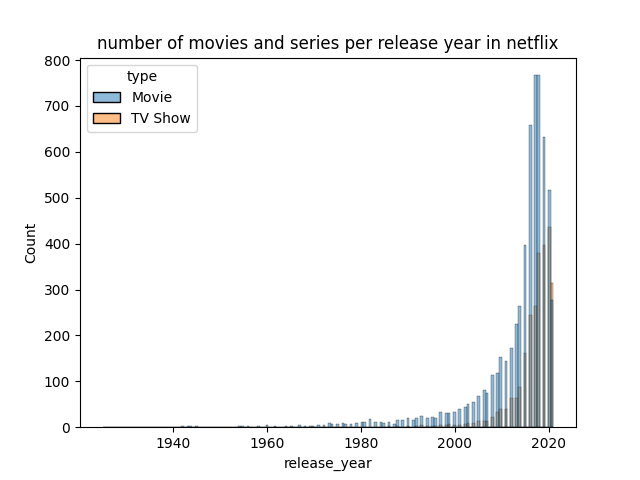
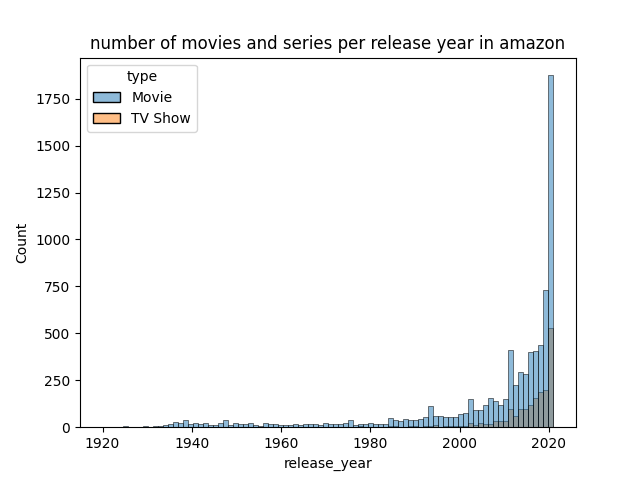
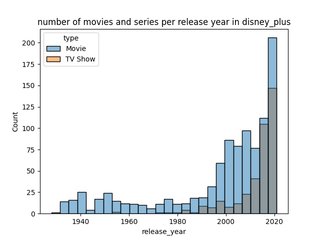
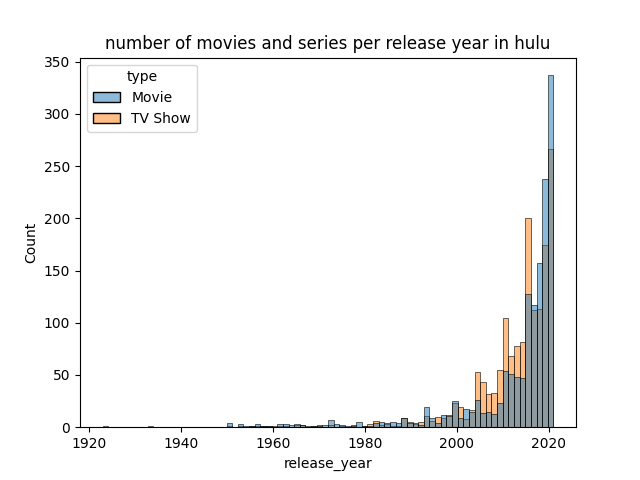

# streaming_analysis

Esse repositório fornece um módulo para análises simples de dados do catálogo de quatro das maiores plataformas de streaming: Netflix, Amazon Prime, Disney+ e Hulu. Com esse módulo, pode-se pegar os dados de streamings especificos, filtrados por colunas ou diretamente selecionados com base em valores especificos(ex: apenas filmes de 'drama'). Existe a possibilidade ainda de "contar" quantas ocorrências de um valor especifico existem em cada plataforma (ex: quantos filmes do diretor "Christopher Nolan" cada plataforma possui). O script 'main.py' possui um exemplo de uso, com a geração de histogramas para numero de fimes por ano de lançamento em cada um dos catálogos.

Abaixo, as imagens geradas.

Histograma de número de titulos por ano de lançamentos na Netflix 

Histograma de número de titulos por ano de lançamentos na Amazon 

Histograma de número de titulos por ano de lançamentos na Disney+ 

Histograma de número de titulos por ano de lançamentos no Hulu 

Esse projeto consistiu em três partes: coleta dos csv com os dados e publicação [nesse repositório](https://github.com/wandgibaut/streamings_catalogues). A criação de uma API que lê esses dados e os disponibiza. Essa API está disponível [aqui](https://data-api-zeta.vercel.app/). A última parte é exatamente este repositório. Como minha idea foi criar algo legal que outras pessoas podem achar interessantes.

Este projeto foi desenvolvido como tarefa do curso da "Let's Code" e os recursos estão limitados ao que foi ensinado até então.

